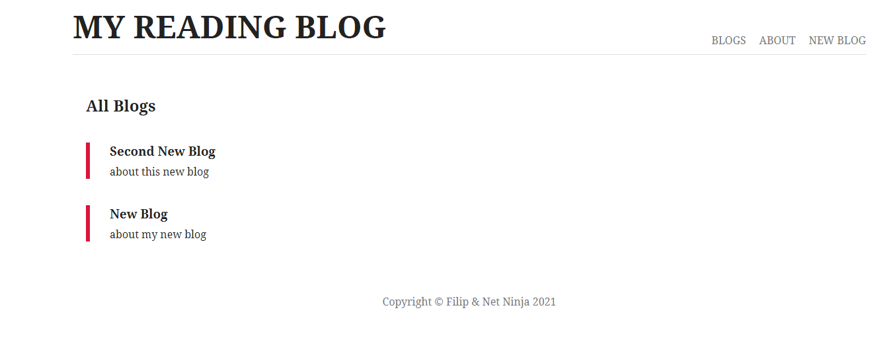
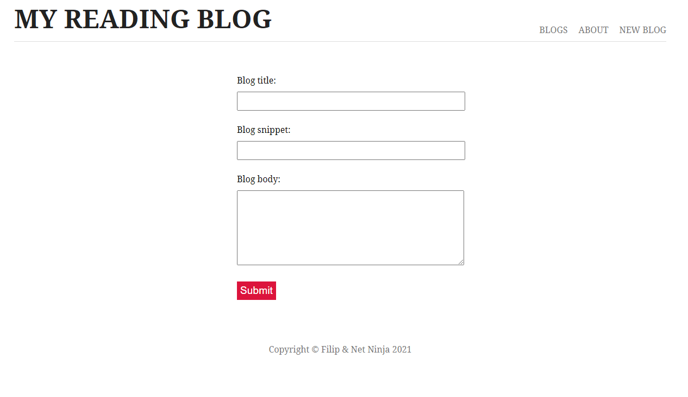
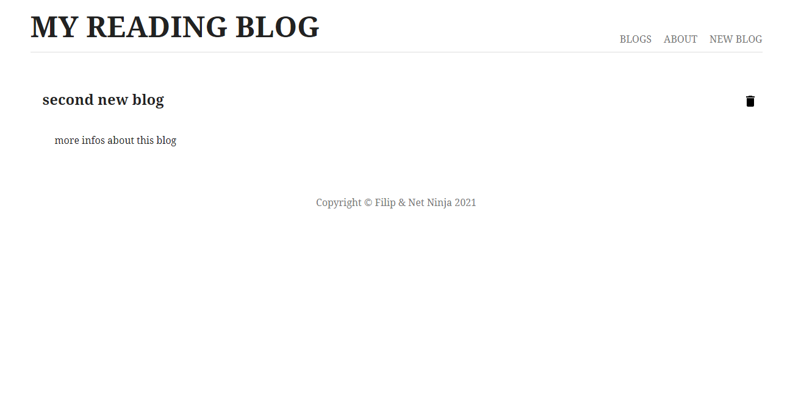

### `Node Js Revisions`

 

> Going back to Node Js to review the basics :
>
> > Creating CRUD routes
> >
> > Using Express framework
> >
> > Adding front views with EJS
> >
> > Applying MVC pattern

 

 

 

 

 

Thanks to [The Net Ninja](https://www.youtube.com/playlist?list=PL4cUxeGkcC9jsz4LDYc6kv3ymONOKxwBU) for proposing quick and nice Node Js reminder :smile:

 
